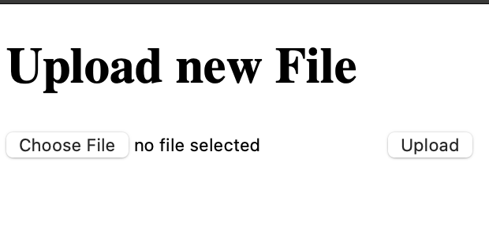
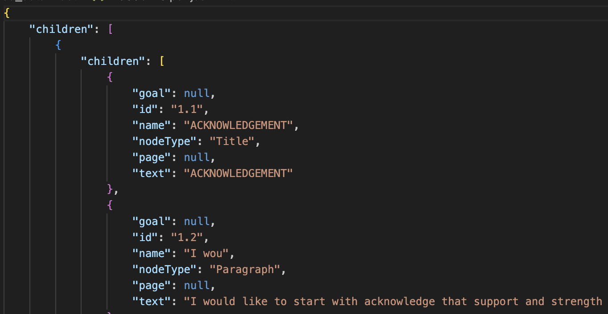

# ACT

## Description
This folder contains the files and resources related to the ACT (Answer_based_Tree) project.


## Constructing Answer-based Tree (ACT)

### Each node attributes:
- ID
- Type
- Text
- Goal

#### Node Type: 
- Paragraph
- Section
- Root

### Algorithm:
```python
Constructing_Answer_based_Tree(ACT, Answer) {
    Input: Answer
    Output: ACT tree

    Create an empty ACT tree with a root node R with Null values
    Expand ACT in such way that {
        all internal nodes are related to the section or subsection
        child nodes of a section node are subsections of the section or are paragraphs or captions in that section related to the section
        all leaf nodes are related to paragraphs to caption
        text of internal node is the title of the section
        text of a leaf node is paragraph or section
        For all leaf nodes N that are paragraphs, N.Goal = LLM_Pragraph_Main_Goal(N.Text)
        For all leaf nodes N that are captions, N.Goal is a summary of the caption
        For all internal node N, N.Goal =
    }
}
```

## Getting Started

### 1. Clone the repository:
   ```bash
   git clone https://github.com/dannguyen99/Yirigaa_NLP
   ```

### 2. **Install dependencies:**
   ```bash
   pip install -r requirements.txt
   ```

### 3. Set up your OpenAI API key:
   * Obtain an API key from [https://beta.openai.com/account/api-keys](https://beta.openai.com/account/api-keys)
   * Set up your API key [https://platform.openai.com/docs/quickstart/step-2-set-up-your-api-key](https://platform.openai.com/docs/quickstart/step-2-set-up-your-api-key)

   On MacOs:
   * Export the key as an environment variable `OPENAI_API_KEY`:
     ```bash
     cd ACT/src
     export OPENAI_API_KEY=your_api_key 
     ```

### 4. Run the Flask API:
   ```bash
   flask --app act_api run --debug
   ```

### 5. Access the API in your browser:

1. **Open your web browser** (e.g., Chrome, Firefox, Safari).

2. **In the address bar, type:** 
   ```
   http://127.0.0.1:5000/build-act
   ```

3. **Press Enter or Return** to load the API endpoint.

## Usage

**1. Upload a PDF report to the API system**



**2. The output tree will be store at the file ** uploaded file name.json**

**Example**

**1. JSON tree**



**2. Tree Visualize**


## Project Structure

* `src/`
   * `act.py`: (Main ACT tree logic)
   * `act_api.py`:  (Flask API implementation)
   * `assistant.py`: (Interaction with OpenAI GPT-3)
   * `pdf_utils.py`:  (PDF processing functions)
   * `sample_act.json`: (Example input ACT data)
   * `sample_act_tree.py`: (Example script to demonstrate ACT tree building)
   * `act_tree.png`: (Optional - an image visualizing an ACT tree structure)
   * `requirements.txt`: (List of project dependencies)


## Contributing
1. Fork this repository.
2. Create a new branch: `git checkout -b feature/your-feature-name`.
3. Make your changes and commit them: `git commit -m 'Add some feature'`.
4. Push to the branch: `git push origin feature/your-feature-name`.
5. Submit a pull request.

## License
This project is licensed under the [MIT License](LICENSE).

## Contact
For any questions or suggestions, please feel free to reach out to us at [dannguyen0801@gmail.com](dannguyen0801@gmail.com).
   
   